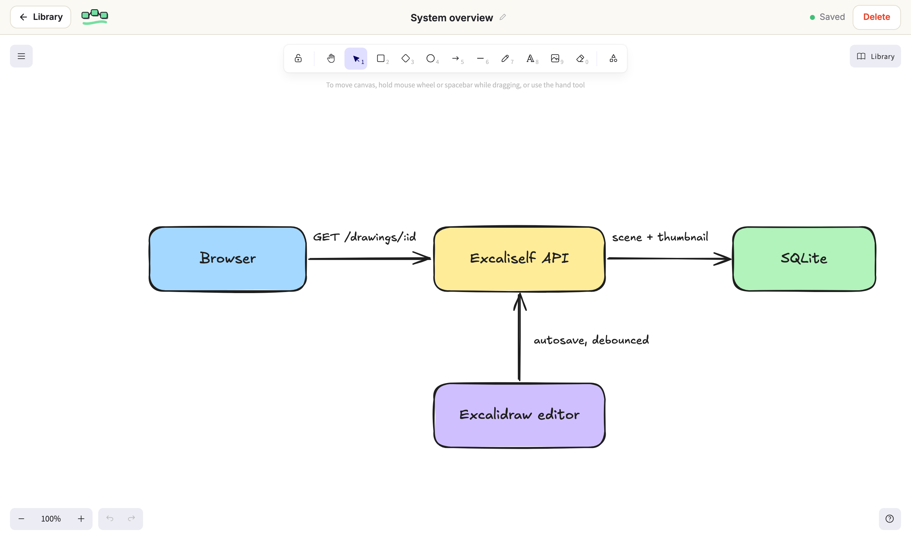

# Excaliself: Simple Excalidraw for Self-Hosters



## Summary

Excaliself is a simple, self-hosted Excalidraw library.

It is the Excalidraw editor you already know, with a place to keep your drawings: a library of nested folders on your own server, with thumbnails, search over the text inside every drawing, and nothing leaving your machine. No accounts, no cloud, no CDN.

Start the Excaliself container, and receive:

- the full Excalidraw editor, including export to PNG and SVG and copying selections to the clipboard
- a persisted library with custom folder support
- search across folders, by name and by the text inside a drawing
- ... and much more!

## Quickstart / Demo

```sh
docker run --rm -p 3000:3000 butterhosting/excaliself
```

## Documentation

Please visit [www.butterhost.ing/excaliself](https://www.butterhost.ing/excaliself) for the full documentation, covering deployment, the library, the editor, tips, tricks and more.
